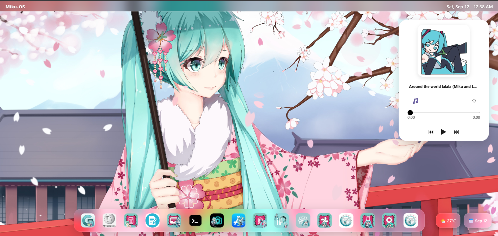

# HATSUNE MIKU OS 

* I made this cool miku-OS whic has many real life os like fuction any many more funtionality and it has

# Screenshot 

# Demo link 

https://15freaker.github.io/anims-miku-OS/

# programming language 

* i used vite for this project 
 

# features

* you can change its bg
* you can install or uninstall apps
* it has search engine
* it has every feature a low level OS has
* it can show weather
* it has a calender
* it has a small music player where you can like or change music 

# Apps

* timer
* calculator
* paint
* color selector
* photos viewer
* folder
* notes
* setting
* markdown
* code playground
* json editor
* QR genrator
* unit converter
* app store
* music player
* stop watch
* text editor
* terminal 
* google
* terminal

# how to use it locally 

* clone the repo from github
* open file in any code editor
* click "ctrl+`" to open terminal (in vs code)
* type "npm run dev"
* it will open in your browser totally locally.